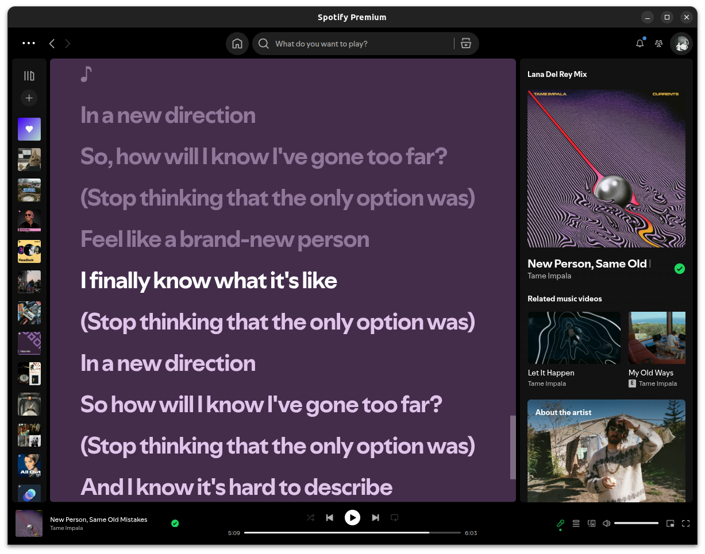

# Markdown Rendering Test

This page is a visual test for the Markdown and MDX renderer. It contains common Markdown elements to make it easy to identify spacing, typography, links, code blocks, lists, images, and other rendering issues.

## Full Paragraph

JavaScript is a versatile programming language that brings life to websites. It allows developers to create interactive features, like image sliders, form validations, and dynamic content updates. When a user clicks a button or fills out a form, JavaScript can respond immediately without the need to reload the page. This smooth interaction improves the overall user experience and makes browsing on the internet more engaging and enjoyable.  
  
One of the remarkable things about JavaScript is its compatibility with all major web browsers. Whether someone is using Chrome, Firefox, or Safari, JavaScript code will run smoothly across these platforms. This feature makes it a popular choice for web developers around the world. Additionally, JavaScript works well with HTML and CSS, which are the backbone of web design. Together, they allow for the creation of visually appealing and highly functional websites.  
  
JavaScript is also widely used beyond just web pages. With the advent of technologies like Node.js, it can be used for server-side programming, enabling developers to build entire applications using only JavaScript. This expands its reach and usability in various domains, including mobile app development and game design. As technology continues to evolve, JavaScript remains a powerful tool that empowers developers and shapes the future of digital interactions.

## Typography

### Headings

# Heading 1

## Heading 2

### Heading 3

#### Heading 4

##### Heading 5

###### Heading 6

### Paragraph

This is a normal paragraph. The purpose of this section is to test the default body font, line height, paragraph spacing, and maximum reading width.

Here is another paragraph with **bold text**, _italic text_, _**bold italic text**_, and ~~strikethrough text~~.

You can also use `inline code` inside a paragraph.

> Markdown should feel simple, readable, and close to plain text.

---

## Links

### External Link

[Visit GitHub](https://github.com/)

[Visit Next.js](https://nextjs.org/)

### Link With Title

[Next.js](https://nextjs.org/ "Next.js official website")

### Autolink

[https://example.com](https://example.com/)

### Email

[hello@example.com](mailto:hello@example.com)

---

## Lists

### Unordered List

- First item
    
- Second item
    
- Third item
    
- Fourth item
    

### Ordered List

1. First item
    
2. Second item
    
3. Third item
    
4. Fourth item
    

### Nested List

- Frontend
    
    - Next.js
        
    - React
        
    - Tailwind CSS
        
- Backend
    
    - Laravel
        
    - NestJS
        
    - FastAPI
        
- Database
    
    - PostgreSQL
        
    - MySQL
        
    - Redis
        

### Task List

-  Markdown support
    
-  MDX support
    
-  Add comments
    
-  Add reactions
    

---

## Blockquotes

### Simple Quote

> The best code is code that solves a real problem.

### Multi-line Quote

> This is a longer blockquote.
> 
> It contains multiple paragraphs and should maintain proper spacing between them.

### Nested Quote

> This is the first level.
> 
> > This is the second level.
> 
> Back to the first level.

---

## Code

### Inline Code

Use `pnpm dev` to start the development server.

Use `const user = await getUser()` to fetch the user.

### JavaScript

```javascript
function greet(name) {
  return `Hello, ${name}!`;
}

console.log(greet("Hilmy"));
```

### TypeScript

```typescript
type User = {
  id: number;
  name: string;
  email: string;
};

const user: User = {
  id: 1,
  name: "Hilmy",
  email: "hello@example.com",
};
```

### React

```tsx
export default function Hero() {
  return (
    <section>
      <h1>Hilmy Haidar</h1>
      <p>Software Engineer</p>
    </section>
  );
}
```

### SQL

```sql
SELECT
    user_id,
    SUM(amount) AS total_volume
FROM transactions
WHERE asset = 'BTC'
GROUP BY user_id
ORDER BY total_volume DESC;
```

### Bash

```bash
pnpm install
pnpm dev
git status
git add .
git commit -m "feat: add markdown test"
```

### JSON

```json
{
  "name": "markdown-test",
  "version": "1.0.0",
  "framework": "nextjs",
  "content": "mdx"
}
```

### Long Code

```typescript
async function processTransaction(
  transactionId: string,
  userId: string,
  amount: number,
) {
  const transaction = await database.transaction.findUnique({
    where: {
      id: transactionId,
    },
  });

  if (!transaction) {
    throw new Error("Transaction not found");
  }

  if (transaction.userId !== userId) {
    throw new Error("Unauthorized transaction");
  }

  return database.transaction.update({
    where: {
      id: transactionId,
    },
    data: {
      amount,
      status: "processed",
    },
  });
}
```

---

## Tables

### Simple Table

|Name|Role|Status|
|---|---|---|
|Hilmy|Engineer|Active|
|Alice|Designer|Active|
|Bob|Manager|Away|

### Technical Table

|Technology|Category|Experience|
|---|---|--:|
|TypeScript|Language|4 years|
|Next.js|Framework|3 years|
|Laravel|Framework|2 years|
|PostgreSQL|Database|2 years|
|Redis|Infrastructure|2 years|

---

## Images

### Normal Image



### Image With Caption


_A technical workspace._

---

## Horizontal Rules

Content above the separator.

---

Content below the separator.

---

## Nested Content

### Project Example

Here is an example of a project description containing multiple Markdown elements.

#### Features

- Authentication
    
- Authorization
    
- API integration
    
- Database persistence
    
- Background jobs
    

#### Architecture

The application consists of several services:

1. Web application
    
2. API server
    
3. Worker
    
4. Database
    
5. Redis
    

#### Example

```text
Client
  │
  ▼
Next.js
  │
  ▼
API
  │
  ├── PostgreSQL
  └── Redis
```

> Good architecture is not about having more services.  
> It is about having the right boundaries.

---

## Mixed Content

This paragraph contains **bold text**, _italic text_, `inline code`, and a [link](https://github.com/) all together.

You can also combine lists with code:

1. Install dependencies:
    
    ```bash
    pnpm install
    ```
    
2. Start development:
    
    ```bash
    pnpm dev
    ```
    
3. Open the browser:
    
    `http://localhost:3000`
    

---

## Empty Spacing Test

This section intentionally contains multiple paragraphs to test vertical rhythm.

The first paragraph should have enough breathing room from the heading above.

The second paragraph should be visually separated from the first without feeling excessively loose.

The third paragraph exists to test how the renderer handles consecutive paragraphs.

---

## Final Section

If all of these elements render correctly, your Markdown renderer should be handling:

- Typography
- Headings
- Paragraphs
- Links
- Lists
- Task lists
- Blockquotes
- Inline code
- Code blocks
- Tables
- Images
- Horizontal rules
- Nested content
- Mixed Markdown elements

This is the end of the Markdown rendering test.

